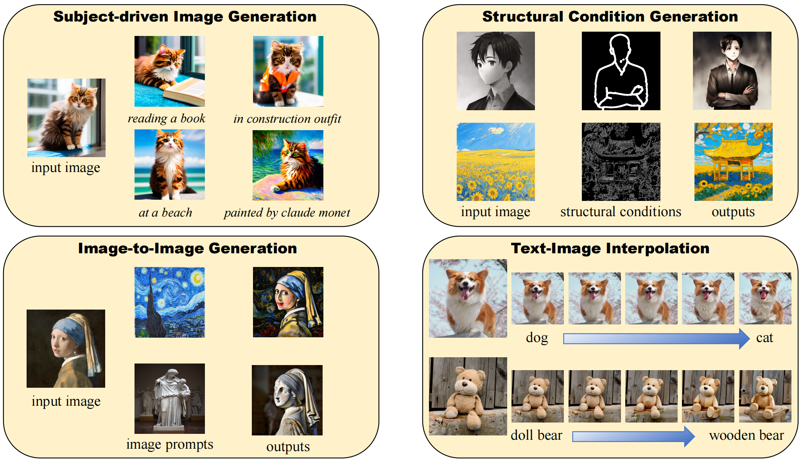

# ___***TIDE: Achieving Balanced Subject-Driven Image Generation via Target-Instructed Diffusion Enhancement***___
This repository gives the official implementation of TIDE: Achieving Balanced Subject-Driven Image Generation via Target-Instructed Diffusion Enhancement



### [Paper]()

## Abstract
>Subject-driven image generation (SDIG) aims to manipulate specific subjects within images while adhering to textual instructions, a task crucial for advancing text-to-image diffusion models. SDIG requires reconciling the tension between maintaining subject identity and complying with dynamic edit instructions, a challenge inadequately addressed by existing methods. In this paper, we introduce the Target-Instructed Diffusion Enhancing (TIDE) framework, which resolves this tension through target supervision and preference learning without test-time fine-tuning. TIDE pioneers target-supervised triplet alignment, modelling subject adaptation dynamics using a (reference image, instruction, target images) triplet. This approach leverages the Direct Subject Diffusion (DSD) objective, training the model with paired "winning" (balanced preservation-compliance) and "losing" (distorted) targets, systematically generated and evaluated via quantitative metrics. This enables implicit reward modelling for optimal preservation-compliance balance. Experimental results on standard benchmarks demonstrate TIDE's superior performance in generating subject-faithful outputs while maintaining instruction compliance, outperforming baseline methods across multiple quantitative metrics. TIDE's versatility is further evidenced by its successful application to diverse tasks, including structural-conditioned generation, image-to-image generation, and text-image interpolation. Our code is available here (https://github.com/KomJay520/TIDE)

## Installation

```
# install latest diffusers
pip install diffusers==0.22.1
pip install jupyter
pip install -r requirements.txt

# then you can use the notebook
```

## Download Models

We provide our tide model [here](https://doi.org/10.5281/zenodo.16941397) 
tide_sdv1.5.bin is TIDE's model. Put it into models/tide
rename the image encoder's model file name(image_encoder_pytorch_model.bin) as "pytorch_model.bin" and put it into models/image_encoder

To run the demo, you should also download the following models:
- [runwayml/stable-diffusion-v1-5](https://huggingface.co/runwayml/stable-diffusion-v1-5)
- [stabilityai/sd-vae-ft-mse](https://huggingface.co/stabilityai/sd-vae-ft-mse)
- [ControlNet models](https://huggingface.co/lllyasviel)

## Download Training Data
We also provide our training dataset C4DD [here](https://doi.org/10.5281/zenodo.16941397)
The data structure is like this:
```
data
├── prompts
│  ├── prompt0.txt
│  ├── prompt1.txt
│  ├── ...
├── source
│  ├── <category0>
│  │  ├── 0.png
│  │  ├── 1.png
│  │  ├── ...
│  ├── <category1>
│  │  ├── 0.png
│  │  ├── 1.png
│  │  ├── ...
│  ├── ...
├── TI
│  ├── <category0>
│  │  ├── 0.png
│  │  ├── 1.png
│  │  ├── ...
│  ├── <category1>
│  │  ├── 0.png
│  │  ├── 1.png
│  │  ├── ...
│  ├── ...
├── ...
```

## Train Models
Before training, please prepare at least two 32G graphics cards for the training process. In addition to the above-mentioned SD models you need to have ready, your training data should be stored in the "data" folder and you need to create the "dpo_data.json" file. After that, you can directly run
```
python dsd_train_tide.py
```
to start the training.

## Use TIDE model
We provide tide_demo.ipynb and tide_controlnet_demo.ipynb for using the model. You can use Jupyter Notebook to run them.
```
source your_env/bin/source
jupyter notebook
```

## Maintenance

Please open a GitHub issue for any help. If you have any questions regarding the technical details, feel free to contact us. 

## License

This project is licensed under the MIT License. See LICENSE.txt for the full MIT license text.
