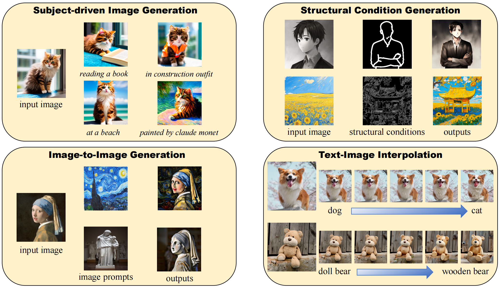
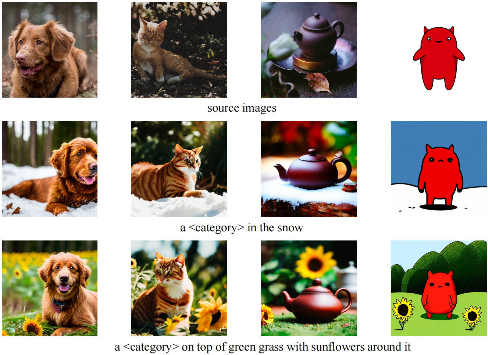
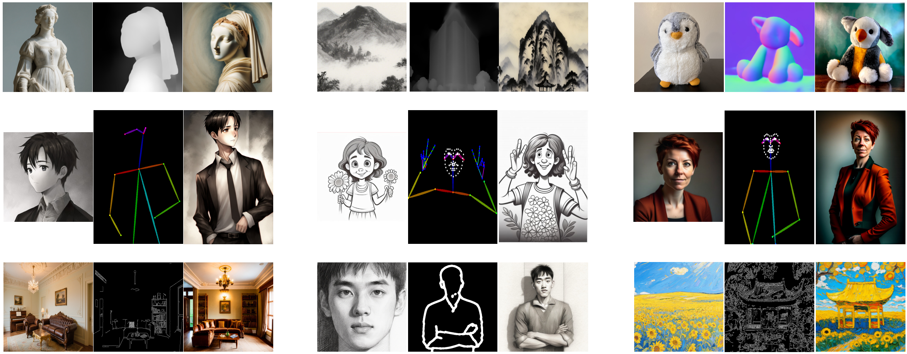

# ___***TIDE: Target-Instructed Diffusion Enhancement for Personalizing Image Generation***___
This repository gives the official implementation of TIDE: Target-Instructed Diffusion Enhancement for Personalizing Image Generation



## [Paper](https://arxiv.org/abs/2509.06499)
Our paper is released here.

## Abstract
>Personalized image generation aims to perform controllable editing and generation of specific subjects based on reference 
images and textual instructions. Existing methods lack supervision signals that can uniformly constrain subjects, instructions, and 
generation results in complex textual editing tasks, leading to inconsistency between training objectives and the final personalized 
generation task goals. Consequently, models struggle to learn a stable and optimal balance between subject fidelity and instruction 
compliance. To address this issue, this paper proposes a test-time fine-tuning free Target-Instructed Diffusion Enhancement (TIDE) 
method. Specifically, the method constructs a triplet supervised dataset consisting of reference images, textual instructions, and target 
images to provide multimodal constraints and target supervision for the model. It achieves multimodal information interaction through 
a lightweight feature fusion module while keeping the base model parameters unchanged. On this basis, Direct Subject Diffusion 
Optimization (DSDO) is designed, which takes the trajectory differences between winning and losing target images in the noise space 
as implicit rewards. These implicit rewards guide the diffusion model to achieve the optimal balance between subject fidelity and 
instruction compliance during generation. Experimental results show that on the DreamBench and Concept101 benchmarks, the proposed method achieves the optimal comprehensive performance across multiple core metrics and exhibits excellent zero-shot generalization 
capability in various downstream tasks.

## Installation

```
# install latest diffusers
pip install diffusers==0.22.1
pip install jupyter
pip install -r requirements.txt

# then you can use the notebook
```

## Download Models

We provide our tide model [here](https://doi.org/10.5281/zenodo.16941397) 
tide_sdv1.5.bin is TIDE's model. Put it into models/tide
rename the image encoder's model file name(image_encoder_pytorch_model.bin) as "pytorch_model.bin" and put it into models/image_encoder

To run the demo, you should also download the following models:
- [runwayml/stable-diffusion-v1-5](https://huggingface.co/runwayml/stable-diffusion-v1-5)
- [stabilityai/sd-vae-ft-mse](https://huggingface.co/stabilityai/sd-vae-ft-mse)
- [ControlNet models](https://huggingface.co/lllyasviel)

## Download Training Data
We also provide our training dataset C4DD [here](https://doi.org/10.5281/zenodo.16941397)
The data structure is like this:
```
data
├── prompts
│  ├── prompt0.txt
│  ├── prompt1.txt
│  ├── ...
├── source
│  ├── <category0>
│  │  ├── 0.png
│  │  ├── 1.png
│  │  ├── ...
│  ├── <category1>
│  │  ├── 0.png
│  │  ├── 1.png
│  │  ├── ...
│  ├── ...
├── TI
│  ├── <category0>
│  │  ├── 0.png
│  │  ├── 1.png
│  │  ├── ...
│  ├── <category1>
│  │  ├── 0.png
│  │  ├── 1.png
│  │  ├── ...
│  ├── ...
├── ...
```

## Train Models
Before training, please prepare at least two 32G graphics cards for the training process. In addition to the above-mentioned SD models you need to have ready, your training data should be stored in the "data" folder and you need to create the "dpo_data.json" file. After that, you can directly run
```
python dsd_train_tide.py
```
to start the training.

## Use TIDE model
We provide tide_demo.ipynb and tide_controlnet_demo.ipynb for using the model. You can use Jupyter Notebook to run them.
```
source your_env/bin/source
jupyter notebook
```
With TIDE, it is easy to generate customed images like following:


Beside, if you want to use some condiction image to guide the generation, you can generate images like following:


## Evaluate TIDE model
We provide eval_dreambanch.ipynb and eval_concept101.ipynb in eval/eval_SDIG for evaluating TIDE for SDIG task. You can use Jupyter Notebook to run them. 

Furthermore, following REFace's evaluation setting, we evaluate TIDE in face swapping task. The evaluating tools are in eval/eval_face.

## Maintenance

Please open a GitHub issue for any help. If you have any questions regarding the technical details, feel free to contact us. 

## License

This project is licensed under the MIT License. See LICENSE.txt for the full MIT license text.

## Citation  
If you use this code, dataset, or method in your research, please cite our manuscript:  

```bibtex
@article{tide2025,
  title={Target-Instructed Diffusion Enhancement for Personalizing Image Generation},
  author={Jibai Lin, Bo Ma, Yating Yang, Xi Zhou, Rong Ma, Ahmat Ahtamjan, Rui Dong},
  journal={Journal of Chinese Computer Systems},
  year={2026},
  note={Paper Number: 2025-0506}
}
